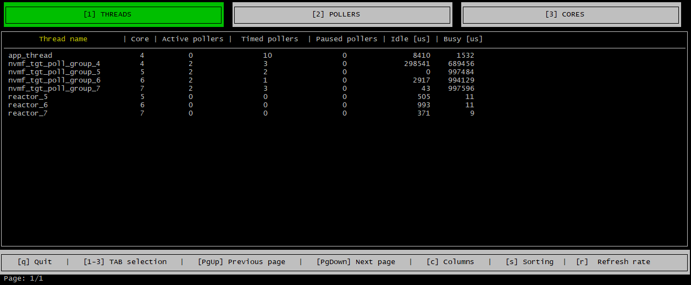
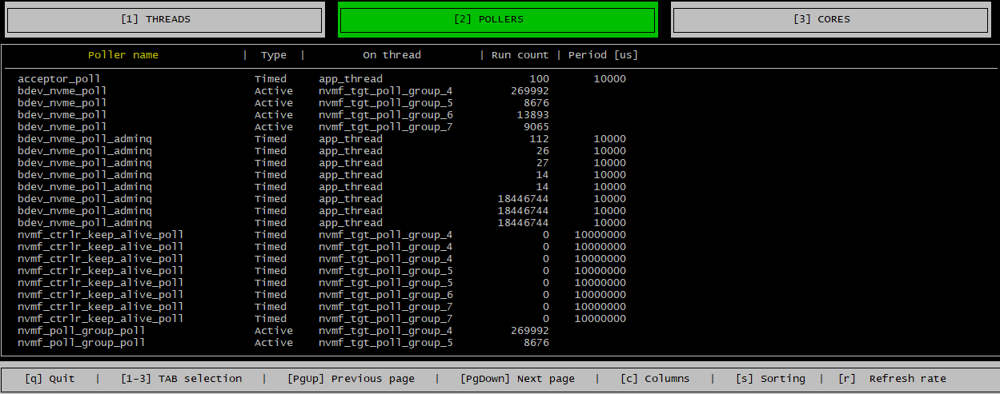
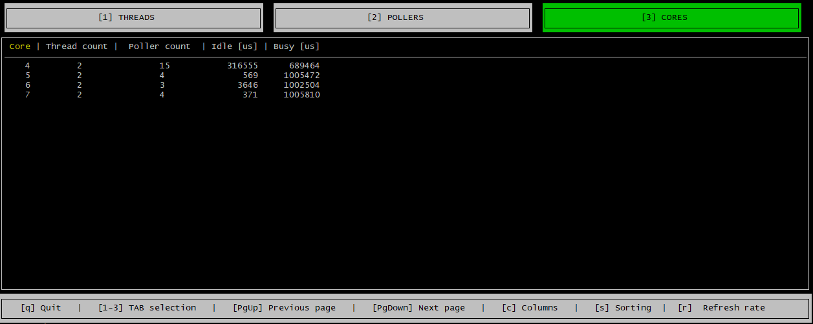

# spdk_top {#spdk_top}

The spdk_top application is designed to resemble the standard top in that it provides a real-time insights into CPU cores usage by SPDK lightweight threads and pollers. Have you ever wondered which CPU core is used most by your SPDK instance? Are you building your own bdev or library and want to know if your code is running efficiently? Are your new pollers busy most of the time? The spdk_top application uses RPC calls to collect performance metrics and displays them in a report that you can analyze and determine if your code is running efficiently so that you can tune your implementation and get more from SPDK.

Why doesn't the classic top utility work for SPDK? SPDK uses a polled-mode design; a reactor thread running on each CPU core assigned to an SPDK application schedules SPDK lightweight threads and pollers to run on the CPU core. Therefore, the standard Linux top utility is not effective for analyzing the CPU usage for polled-mode applications like SPDK because it just reports that they are using 100% of the CPU resources assigned to them. The spdk_top utility was developed to analyze and report the CPU cycles used to do real work vs just polling for work. The utility relies on instrumentation added to pollers to track when they are doing work vs. polling for work. The spdk_top utility gets the fine grained metrics from the pollers, analyzes and report the metrics on a per poller, thread and core basis. This information enables users to identify CPU cores that are busy doing real work so that they can determine if the application needs more or less CPU resources.

# Run spdk_top
Before running spdk_top you need to run the SPDK application whose performance you want to analyze using spdk_top. For example, the nvmf_tgt application was running when we used the spdk_top to capture the screen shots in this documentation.

Run the spdk_top application

~~~{.sh}
./build/bin/spdk_top
~~~

The spdk_top application has 3 tabs: the cores, threads and pollers tabs.

# Threads Tab
The threads tab displays a line item for each spdk thread that includes information such as which CPU core the spdk thread is running on, how many pollers the thread is running and how many microseconds was the thread busy/idle. The pollers are grouped into active, timed and pause pollers. To learn more about spdk threads see @ref concurrency.

# Pollers Tab
The pollers tab displays a line item for each poller and a running counter of the number of times the poller has run so that you can see which pollers are running most frequently.

# Cores Tab
The cores tab provides insights into how the application is using the CPU cores assigned to it.
It has a line item for each CPU core assigned to the application which shows the number of threads and poller
running on the CPU core. The tab also indicates how busy/idle the each CPU core was in the last 1 second.
The busy column displays how many microseconds the CPU core was doing actual work in the last 1 second.
The idle column displays how many microseconds the CPU core was idle in the last 1 second,
including the time when the CPU core ran pollers but did not find any work.

# Refresh Rate
You can control how often the spdk_top application refreshes the data displayed by hitting the 'r' key on your keyboard and specifying a value between 0 and 255 seconds.

# Sorting
You can sort the data displayed by hitting the 's' key on your keyboard and selecting a column to sort by in the sub menu that is displayed.

# Filtering
You can filter out any column by hitting the 'c' key on your keyboard and unselecting the column in the menu that is displayed.
