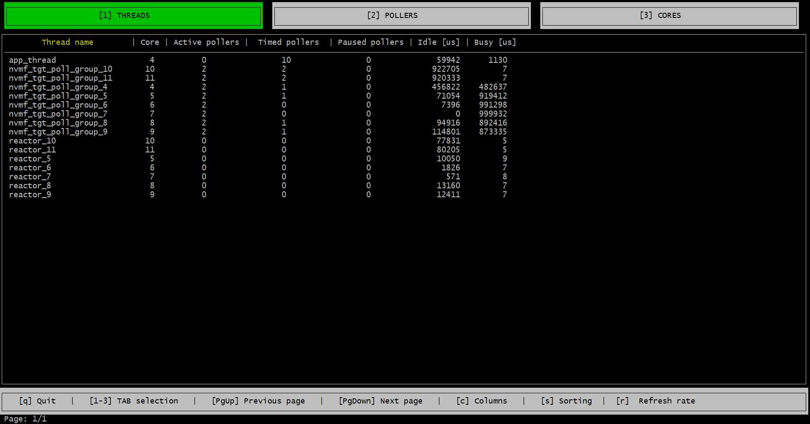

# spdk_top Application {#spdk_top}

The spdk_top application is designed to resemble the standard top in that it provides a real-time insights into CPU cores usage by SPDK lightweight threads and pollers. Have you ever wondered which CPU core is used most by your SPDK instance? Are you building your own bdev or library and want to know if your code is running efficiently? Are your new pollers busy most of the time? The spdk_top application uses RPC calls to collect performance metrics and displays a performance report that you can analyze and determine if your code is running efficiently so that you can tune your implementation and get more from SPDK.

# Run spdk_top
Before running the spdk_top application launch your SPDK application and start sending I/Os to the application.

Run the spdk_top application

~~{.sh}
./build/bin/spdk_top
~~

The spdk_top application has 3 tabs: Cores, Threads and Pollers

## Threads Tab
The threads tab has a line item for each lightweight thread and what pollers the thread is running

## Pollers Tab

## Cores Tab
The Cores tab provides insights into how the application is using the CPU cores assigned to it.

## Sorting

## Filtering
