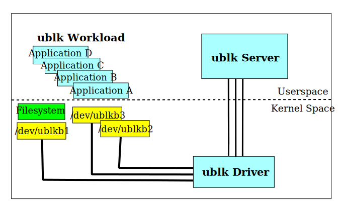

# ublk Target {#ublk}

## Table of Contents {#ublk_toc}

- @ref ublk_intro
- @ref ublk_internal
- @ref ublk_impl
- @ref ublk_op

## Introduction {#ublk_intro}

[ublk](https://docs.kernel.org/block/ublk.html) (or ubd) is a generic framework for
implementing generic userspace block device based on `io_uring`.  It is designed to
create a highly efficient data path for userspace storage software to provide
high-performance block device service in local host.

The whole ublk service involves three parts: ublk driver, ublk server and ublk workload.

* __ublk driver__ is a kernel driver added to kernel 6.0.  It delivers I/O requests
  from a ublk block device(`/dev/ublkbN`) into a ublk server.

* __ublk workload__ can be any local host process which submits I/O requests to a ublk
  block device or a kernel filesystem on top of the ublk block device.

* __ublk server__ is the userspace storage software that fetches the I/O requests delivered
  by the ublk driver.  The ublk server will process the I/O requests with its specific block
  service logic and connected backends.  Once the ublk server gets the response from the
  connected backends, it communicates with the ublk driver and completes the I/O requests.

SPDK ublk target acts as a ublk server.  It can handle ublk I/O requests within the whole
SPDK userspace storage software stack.

A typical usage scenario is for container attached storage:

* Real storage resources are assigned to SPDK, like physical NVMe devices and
  distributed block storage.
* SPDK creates refined block devices via ublk kernel module on top of its organized
  storage resources, based on user configuration.
* Container orchestrator and runtime can then mount and stage the ublk block devices
  for container instances to use.

## ublk Internal {#ublk_internal}

Previously, the design of putting I/O processing logic into userspace software always has a
noticeable interaction overhead between the kernel module and userspace part.

ublk utilizes `io_uring` which has been proven to be very efficient in decreasing the
interaction overhead.  The I/O request is delivered to the userspace ublk server via the
newly added `io_uring` command.  A shared buffer via `mmap` is used for sharing I/O descriptor
to userspace from the kernel driver.  The I/O data is copied only once between the specified
userspace buffer address and request/bio's pages by the ublk driver.

### Control Plane

A control device is create by ublk kernel module at `/dev/ublk-control`.  Userspace server
sends control commands to kernel module via the control device using `io_uring`.

Control commands includes add, configure, and start new ublk block device.
Retrieving device information, stop and delete existing ublk block device are also there.

The add device command creates a bulk char device `/dev/ublkcN`.
It will be used by the ublk userspace server to `mmap` I/O descriptor buffer.
The start device command exposes a ublk block device `/dev/ublkbN`.
The block device can be formatted and mounted by a kernel filesystem,
or read/written directly by other processes.

### Data Plane

The datapath between ublk server and kernel driver includes `io_uring` and shared
memory buffer.  The shared memory buffer is an array of I/O descriptors.
Each SQE (Submission Queue Entry) in `io_uring` is assigned one I/O descriptor and
one user buffer address.  When ublk kernel driver receives I/O requests from upper
layer, the information of I/O requests will be filled into I/O descriptors by ublk
kernel driver.  The I/O data is copied between the specified user buffer address and
request/bio's pages at the proper time.

At start, the ublk server needs to fill the `io_uring` SQ (Submission Queue).  Each
SQE is marked with an operation flag `UBLK_IO_FETCH_REQ` which means the SQE is
ready to get I/O request.

When a CQE (Completion Queue Entry) is returned from the `io_uring` indicating I/O
request, the ublk server gets the position of the I/O descriptor from CQE.
The ublk server handles the I/O request based on information in the I/O descriptor.

After the ublk server completes the I/O request, it updates the I/O's completion status
and ublk operation flag.  This time, the operation flag is `UBLK_IO_COMMIT_AND_FETCH_REQ`
which informs kernel module that one I/O request is completed, and also the SQE slot
is free to fetch new I/O request.

`UBLK_IO_COMMIT_AND_FETCH_REQ` is designed for efficiency in ublk. In runtime, the ublk
server needs to commit I/O results back, and then provide new free SQE slots for fetching
new I/O requests.  Without `UBLK_IO_COMMIT_AND_FETCH_REQ` flag, `io_uring_submit()` should
be called twice,  once for committing I/O results back, once for providing free SQE slots.
With `UBLK_IO_COMMIT_AND_FETCH_REQ` flag, calling `io_uring_submit()` once is enough because
the ublk driver realizes that the submitted SQEs are reused both for committing back I/O
results and fetching new requests.

## SPDK Implementation {#ublk_impl}

SPDK ublk target is implemented as a high performance ublk server.

It creates one ublk spdk_thread on each spdk_reactor by default or on user specified
reactors.  When adding a new ublk block device, SPDK ublk target will assign queues
of ublk block device to ublk spdk_threads in round-robin.
That means one ublk device queue will only be processed by one spdk_thread.
One ublk device with multiple queues can get multiple spdk reactors involved
to process its I/O requests;
One spdk_thread created by ublk target may process multiple queues, each from
different ublk devices.
In this way, spdk reactors can be fully utilized to achieve best performance,
when there are only a few ublk devices.

ublk is `io_uring` based. All ublk I/O queues are mapped to `io_uring`.
ublk spdk_thread gets I/O requests from available CQEs by polling all its assigned
`io_uring`s.
When there are completed I/O requests, ublk spdk_thread will submit them as SQE back
to `io_uring` in batch.

Currently, ublk driver has a system thread context limitation that one ublk device queue
can be only processed in the context of system thread which initialized the it.  SPDK
can't schedule ublk spdk_thread between different SPDK reactors.  In other words, SPDK
dynamic scheduler can't rebalance ublk workload by rescheduling ublk spdk_thread.

## Operation {#ublk_op}

### Enabling SPDK ublk target

Build SPDK with SPDK ublk target enabled.

~~~{.sh}
./configure --with-ublk
make -j
~~~

SPDK ublk target related libaries will then be linked into SPDK appliation `spdk_tgt`.
Setup some hugepages for the SPDK, and then run the SPDK application `spdk_tgt`.

~~~{.sh}
scripts/setup.sh
build/bin/spdk_tgt &
~~~

Once the `spdk_tgt` is initialized, user can enable SPDK ublk feature
by creating ublk target. However, before creating ublk target, ublk kernel module
`ublk_drv` should be loaded using `modprobe`.

~~~{.sh}
modprobe ublk_drv
scripts/rpc.py ublk_create_target
~~~

### Creating ublk block device

SPDK bdevs are block devices which will be exposed to the local host kernel
as ublk block devices.  SPDK supports several different types of storage backends,
including NVMe, Linux AIO, malloc ramdisk and Ceph RBD.  Refer to @ref bdev for
additional information on configuring SPDK storage backends.

This guide will use a malloc bdev (ramdisk) named Malloc0. The following RPC
will create a 256MB malloc bdev with 512-byte block size.

~~~{.sh}
scripts/rpc.py bdev_malloc_create 256 512 -b Malloc0
~~~

The following RPC will create a ublk block device exposing Malloc0 bdev.
The created ublk block device has ID 1.  It internally has 2 queues with
queue depth 128.

~~~{.sh}
scripts/rpc.py ublk_start_disk Malloc0 1 -q 2 -d 128
~~~

This RPC will reply back the ID of ublk block device.
~~~
1
~~~

The position of ublk block device is determined by its ID. It is created at `/dev/ublkb${ID}`.
So the device we just created will be accessible to other processes via `/dev/ublkb1`.
Now applications like FIO or DD can work on `/dev/ublkb1` directly.

~~~{.sh}
dd of=/dev/ublkb1 if=/dev/zero bs=512 count=64
~~~

A ublk block device is a generic kernel block device that can be formatted and
mounted by kernel file system.

~~~{.sh}
mkfs /dev/ublkb1
mount /dev/ublkb1 /mnt/
mkdir /mnt/testdir
echo "Hello，SPDK ublk Target" > /mnt/testdir/testfile
umount /mnt
~~~

### Deleting ublk block device and exit

After usage, ublk block device can be stopped and deleted by RPC `ublk_stop_disk` with its ID.
Specify ID 1, then device `/dev/ublkb1` will be removed.

~~~{.sh}
scripts/rpc.py ublk_stop_disk 1
~~~

If ublk is not used anymore, SPDK ublk target can be destroyed to free related SPDK
resources.

~~~{.sh}
scripts/rpc.py ublk_destroy_target
~~~

Of course, SPDK ublk target and all ublk block devices would be destroyed automatically
when SPDK application is terminated.
