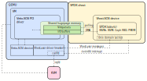

# vhost Target {#vhost}

## Table of Contents {#vhost_toc}

- @ref vhost_intro
- @ref vhost_prereqs
- @ref vhost_start
- @ref vhost_config
- @ref vhost_qemu_config
- @ref vhost_example
- @ref vhost_advanced_topics
- @ref vhost_bugs

## Introduction {#vhost_intro}

A vhost target provides a local storage service as a process running on a local machine.
It is capable of exposing virtualized block devices to QEMU instances or other arbitrary
processes.

The following diagram presents how QEMU-based VM communicates with SPDK Vhost-SCSI device.

The diagram, and the vhost protocol itself is described in @ref vhost_processing doc.

SPDK provides an accelerated vhost target by applying the same user space and polling
techniques as other components in SPDK.  Since SPDK is polling for vhost submissions,
it can signal the VM to skip notifications on submission.  This avoids VMEXITs on I/O
submission and can significantly reduce CPU usage in the VM on heavy I/O workloads.

## Prerequisites {#vhost_prereqs}

This guide assumes the SPDK has been built according to the instructions in @ref
getting_started.  The SPDK vhost target is built with the default configure options.

### Vhost Command Line Parameters {#vhost_cmd_line_args}

Additional command line flags are available for Vhost target.

Param    | Type     | Default                | Description
-------- | -------- | ---------------------- | -----------
-S       | string   | $PWD                   | directory where UNIX domain sockets will be created

### Supported Guest Operating Systems

The guest OS must contain virtio-scsi or virtio-blk drivers.  Most Linux and FreeBSD
distributions include virtio drivers.
[Windows virtio drivers](https://fedoraproject.org/wiki/Windows_Virtio_Drivers) must be
installed separately.  The SPDK vhost target has been tested with recent versions of Ubuntu,
Fedora, and Windows

### QEMU

Userspace vhost-scsi target support was added to upstream QEMU in v2.10.0.  Run
the following command to confirm your QEMU supports userspace vhost-scsi.

~~~{.sh}
qemu-system-x86_64 -device vhost-user-scsi-pci,help
~~~

Userspace vhost-blk target support was added to upstream QEMU in v2.12.0.  Run
the following command to confirm your QEMU supports userspace vhost-blk.

~~~{.sh}
qemu-system-x86_64 -device vhost-user-blk-pci,help
~~~

## Starting SPDK vhost target {#vhost_start}

First, run the SPDK setup.sh script to setup some hugepages for the SPDK vhost target
application.  This will allocate 4096MiB (4GiB) of hugepages, enough for the SPDK
vhost target and the virtual machine.

~~~{.sh}
HUGEMEM=4096 scripts/setup.sh
~~~

Next, start the SPDK vhost target application.  The following command will start vhost
on CPU cores 0 and 1 (cpumask 0x3) with all future socket files placed in /var/tmp.
Vhost will fully occupy given CPU cores for I/O polling. Particular vhost devices can
be restricted to run on a subset of these CPU cores. See @ref vhost_vdev_create for
details.

~~~{.sh}
build/bin/vhost -S /var/tmp -m 0x3
~~~

To list all available vhost options use the following command.

~~~{.sh}
build/bin/vhost -h
~~~

## SPDK Configuration {#vhost_config}

### Create bdev (block device) {#vhost_bdev_create}

SPDK bdevs are block devices which will be exposed to the guest OS.
For vhost-scsi, bdevs are exposed as SCSI LUNs on SCSI devices attached to the
vhost-scsi controller in the guest OS.
For vhost-blk, bdevs are exposed directly as block devices in the guest OS and are
not associated at all with SCSI.

SPDK supports several different types of storage backends, including NVMe,
Linux AIO, malloc ramdisk and Ceph RBD.  Refer to @ref bdev for
additional information on configuring SPDK storage backends.

This guide will use a malloc bdev (ramdisk) named Malloc0. The following RPC
will create a 64MB malloc bdev with 512-byte block size.

~~~{.sh}
scripts/rpc.py bdev_malloc_create 64 512 -b Malloc0
~~~

### Create a vhost device {#vhost_vdev_create}

#### Vhost-SCSI

The following RPC will create a vhost-scsi controller which can be accessed
by QEMU via /var/tmp/vhost.0. At the time of creation the controller will be
bound to a single CPU core with the smallest number of vhost controllers.
The optional `--cpumask` parameter can directly specify which cores should be
taken into account - in this case always CPU 0. To achieve optimal performance
on NUMA systems, the cpumask should specify cores on the same CPU socket as its
associated VM.

~~~{.sh}
scripts/rpc.py vhost_create_scsi_controller --cpumask 0x1 vhost.0
~~~

The following RPC will attach the Malloc0 bdev to the vhost.0 vhost-scsi
controller.  Malloc0 will appear as a single LUN on a SCSI device with
target ID 0. SPDK Vhost-SCSI device currently supports only one LUN per SCSI target.
Additional LUNs can be added by specifying a different target ID.

~~~{.sh}
scripts/rpc.py vhost_scsi_controller_add_target vhost.0 0 Malloc0
~~~

To remove a bdev from a vhost-scsi controller use the following RPC:

~~~{.sh}
scripts/rpc.py vhost_scsi_controller_remove_target vhost.0 0
~~~

#### Vhost-BLK

The following RPC will create a vhost-blk device exposing Malloc0 bdev.
The device will be accessible to QEMU via /var/tmp/vhost.1. All the I/O polling
will be pinned to the least occupied CPU core within given cpumask - in this case
always CPU 0. For NUMA systems, the cpumask should specify cores on the same CPU
socket as its associated VM.

~~~{.sh}
scripts/rpc.py vhost_create_blk_controller --cpumask 0x1 vhost.1 Malloc0
~~~

It is also possible to create a read-only vhost-blk device by specifying an
extra `-r` or `--readonly` parameter.

~~~{.sh}
scripts/rpc.py vhost_create_blk_controller --cpumask 0x1 -r vhost.1 Malloc0
~~~

### QEMU {#vhost_qemu_config}

Now the virtual machine can be started with QEMU.  The following command-line
parameters must be added to connect the virtual machine to its vhost controller.

First, specify the memory backend for the virtual machine.  Since QEMU must
share the virtual machine's memory with the SPDK vhost target, the memory
must be specified in this format with share=on.

~~~{.sh}
-object memory-backend-file,id=mem,size=1G,mem-path=/dev/hugepages,share=on
-numa node,memdev=mem
~~~

Second, ensure QEMU boots from the virtual machine image and not the
SPDK malloc block device by specifying bootindex=0 for the boot image.

~~~{.sh}
-drive file=guest_os_image.qcow2,if=none,id=disk
-device ide-hd,drive=disk,bootindex=0
~~~

Finally, specify the SPDK vhost devices:

#### Vhost-SCSI

~~~{.sh}
-chardev socket,id=char0,path=/var/tmp/vhost.0
-device vhost-user-scsi-pci,id=scsi0,chardev=char0
~~~

#### Vhost-BLK

~~~{.sh}
-chardev socket,id=char1,path=/var/tmp/vhost.1
-device vhost-user-blk-pci,id=blk0,chardev=char1
~~~

### Example output {#vhost_example}

This example uses an NVMe bdev alongside Mallocs. SPDK vhost application is started
on CPU cores 0 and 1, QEMU on cores 2 and 3.

~~~{.sh}
host:~# HUGEMEM=2048 ./scripts/setup.sh
0000:01:00.0 (8086 0953): nvme -> vfio-pci
~~~

~~~{.sh}
host:~# ./build/bin/vhost -S /var/tmp -s 1024 -m 0x3 &
Starting DPDK 17.11.0 initialization...
[ DPDK EAL parameters: vhost -c 3 -m 1024 --main-lcore=1 --file-prefix=spdk_pid156014 ]
EAL: Detected 48 lcore(s)
EAL: Probing VFIO support...
EAL: VFIO support initialized
app.c: 369:spdk_app_start: *NOTICE*: Total cores available: 2
reactor.c: 668:spdk_reactors_init: *NOTICE*: Occupied cpu socket mask is 0x1
reactor.c: 424:_spdk_reactor_run: *NOTICE*: Reactor started on core 1 on socket 0
reactor.c: 424:_spdk_reactor_run: *NOTICE*: Reactor started on core 0 on socket 0
~~~

~~~{.sh}
host:~# ./scripts/rpc.py bdev_nvme_attach_controller -b Nvme0 -t pcie -a 0000:01:00.0
EAL: PCI device 0000:01:00.0 on NUMA socket 0
EAL:   probe driver: 8086:953 spdk_nvme
EAL:   using IOMMU type 1 (Type 1)
~~~

~~~{.sh}
host:~# ./scripts/rpc.py bdev_malloc_create 128 4096 Malloc0
Malloc0
~~~

~~~{.sh}
host:~# ./scripts/rpc.py vhost_create_scsi_controller --cpumask 0x1 vhost.0
VHOST_CONFIG: vhost-user server: socket created, fd: 21
VHOST_CONFIG: bind to /var/tmp/vhost.0
vhost.c: 596:spdk_vhost_dev_construct: *NOTICE*: Controller vhost.0: new controller added
~~~

~~~{.sh}
host:~# ./scripts/rpc.py vhost_scsi_controller_add_target vhost.0 0 Nvme0n1
vhost_scsi.c: 840:spdk_vhost_scsi_dev_add_tgt: *NOTICE*: Controller vhost.0: defined target 'Target 0' using lun 'Nvme0'

~~~

~~~{.sh}
host:~# ./scripts/rpc.py vhost_scsi_controller_add_target vhost.0 1 Malloc0
vhost_scsi.c: 840:spdk_vhost_scsi_dev_add_tgt: *NOTICE*: Controller vhost.0: defined target 'Target 1' using lun 'Malloc0'
~~~

~~~{.sh}
host:~# ./scripts/rpc.py bdev_malloc_create 64 512 -b Malloc1
Malloc1
~~~

~~~{.sh}
host:~# ./scripts/rpc.py vhost_create_blk_controller --cpumask 0x2 vhost.1 Malloc1
vhost_blk.c: 719:spdk_vhost_blk_construct: *NOTICE*: Controller vhost.1: using bdev 'Malloc1'
~~~

~~~{.sh}
host:~# taskset -c 2,3 qemu-system-x86_64 \
  --enable-kvm \
  -cpu host -smp 2 \
  -m 1G -object memory-backend-file,id=mem0,size=1G,mem-path=/dev/hugepages,share=on -numa node,memdev=mem0 \
  -drive file=guest_os_image.qcow2,if=none,id=disk \
  -device ide-hd,drive=disk,bootindex=0 \
  -chardev socket,id=spdk_vhost_scsi0,path=/var/tmp/vhost.0 \
  -device vhost-user-scsi-pci,id=scsi0,chardev=spdk_vhost_scsi0,num_queues=2 \
  -chardev socket,id=spdk_vhost_blk0,path=/var/tmp/vhost.1 \
  -device vhost-user-blk-pci,chardev=spdk_vhost_blk0,num-queues=2
~~~

Please note the following two commands are run on the guest VM.

~~~{.sh}
guest:~# lsblk --output "NAME,KNAME,MODEL,HCTL,SIZE,VENDOR,SUBSYSTEMS"
NAME   KNAME MODEL            HCTL         SIZE VENDOR   SUBSYSTEMS
sda    sda   QEMU HARDDISK    1:0:0:0       80G ATA      block:scsi:pci
  sda1 sda1                                 80G          block:scsi:pci
sdb    sdb   NVMe disk        2:0:0:0    372,6G INTEL    block:scsi:virtio:pci
sdc    sdc   Malloc disk      2:0:1:0      128M INTEL    block:scsi:virtio:pci
vda    vda                                 128M 0x1af4   block:virtio:pci
~~~

~~~{.sh}
guest:~# poweroff
~~~

~~~{.sh}
host:~# fg
<< CTRL + C >>
vhost.c:1006:session_shutdown: *NOTICE*: Exiting
~~~

We can see that `sdb` and `sdc` are SPDK vhost-scsi LUNs, and `vda` is SPDK a
vhost-blk disk.

## Advanced Topics {#vhost_advanced_topics}

### Multi-Queue Block Layer (blk-mq) {#vhost_multiqueue}

For best performance use the Linux kernel block multi-queue feature with vhost.
To enable it on Linux, it is required to modify kernel options inside the
virtual machine.

Instructions below for Ubuntu OS:

1. `vi /etc/default/grub`
2. Make sure mq is enabled: `GRUB_CMDLINE_LINUX="scsi_mod.use_blk_mq=1"`
3. `sudo update-grub`
4. Reboot virtual machine

To achieve better performance, make sure to increase number of cores
assigned to the VM and add `num_queues` parameter to the QEMU `device`. It should be enough
to set `num_queues=4` to saturate physical device. Adding too many queues might lead to SPDK
vhost performance degradation if many vhost devices are used because each device will require
additional `num_queues` to be polled.

Some Linux distributions report a kernel panic when starting the VM if the number of I/O queues
specified via the `num-queues` parameter is greater than number of vCPUs. If you need to use
more I/O queues than vCPUs, check that your OS image supports that configuration.

### Hot-attach/hot-detach {#vhost_hotattach}

Hotplug/hotremove within a vhost controller is called hot-attach/detach. This is to
distinguish it from SPDK bdev hotplug/hotremove. E.g. if an NVMe bdev is attached
to a vhost-scsi controller, physically hotremoving the NVMe will trigger vhost-scsi
hot-detach. It is also possible to hot-detach a bdev manually via RPC - for example
when the bdev is about to be attached to another controller. See the details below.

Please also note that hot-attach/detach is Vhost-SCSI-specific. There are no RPCs
to hot-attach/detach the bdev from a Vhost-BLK device. If Vhost-BLK device exposes
an NVMe bdev that is hotremoved, all the I/O traffic on that Vhost-BLK device will
be aborted - possibly flooding a VM with syslog warnings and errors.

#### Hot-attach

Hot-attach is done by simply attaching a bdev to a vhost controller with a QEMU VM
already started. No other extra action is necessary.

~~~{.sh}
scripts/rpc.py vhost_scsi_controller_add_target vhost.0 0 Malloc0
~~~

#### Hot-detach

Just like hot-attach, the hot-detach is done by simply removing bdev from a controller
when QEMU VM is already started.

~~~{.sh}
scripts/rpc.py vhost_scsi_controller_remove_target vhost.0 0
~~~

Removing an entire bdev will hot-detach it from a controller as well.

~~~{.sh}
scripts/rpc.py bdev_malloc_delete Malloc0
~~~

## Known bugs and limitations {#vhost_bugs}

### Windows virtio-blk driver before version 0.1.130-1 only works with 512-byte sectors

The Windows `viostor` driver before version 0.1.130-1 is buggy and does not
correctly support vhost-blk devices with non-512-byte block size.
See the [bug report](https://bugzilla.redhat.com/show_bug.cgi?id=1411092) for
more information.

### QEMU vhost-user-blk

QEMU [vhost-user-blk](https://git.qemu.org/?p=qemu.git;a=commit;h=00343e4b54ba) is
supported from version 2.12.
