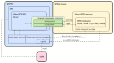

# Virtualized I/O with Vhost-user {#vhost_processing}

# Table of Contents {#vhost_processing_toc}

- @ref vhost_processing_intro
- @ref vhost_processing_qemu
- @ref vhost_processing_init
- @ref vhost_processing_io_path
- @ref vhost_spdk_optimizations

# Introduction {#vhost_processing_intro}

This document is intended to provide an overview of how Vhost works behind the
scenes. Code snippets used in this document might have been simplified for the
sake of readability and should not be used as an API or implementation
reference.

Reading from the
[Virtio specification](http://docs.oasis-open.org/virtio/virtio/v1.0/virtio-v1.0.html):

```
The purpose of virtio and [virtio] specification is that virtual environments
and guests should have a straightforward, efficient, standard and extensible
mechanism for virtual devices, rather than boutique per-environment or per-OS
mechanisms.
```

Virtio devices use virtqueues to transport data efficiently. Virtqueue is a set
of three different single-producer, single-consumer ring structures designed to
store generic scatter-gatter I/O. Virtio is most commonly used in QEMU VMs,
where the QEMU itself exposes a virtual PCI device and the guest OS communicates
with it using a specific Virtio PCI driver. With only Virtio involved, it's
always the QEMU process that handles all I/O traffic.

Vhost is a protocol for devices accessible via inter-process communication.
It uses the same virtqueue layout as Virtio to allow Vhost devices to be mapped
directly to Virtio devices. This allows a Vhost device, exposed by an SPDK
application, to be accessed directly by a guest OS inside a QEMU process with
an existing Virtio (PCI) driver. Only the configuration, I/O submission
notification, and I/O completion interruption are piped through QEMU.
See also @ref vhost_spdk_optimizations

The initial vhost implementation is a part of the Linux kernel and uses ioctl
interface to communicate with userspace applications. What makes it possible for
SPDK to expose a vhost device is Vhost-user protocol.

The [Vhost-user specification](https://git.qemu.org/?p=qemu.git;a=blob_plain;f=docs/interop/vhost-user.txt;hb=HEAD)
describes the protocol as follows:

```
[Vhost-user protocol] is aiming to complement the ioctl interface used to
control the vhost implementation in the Linux kernel. It implements the control
plane needed to establish virtqueue sharing with a user space process on the
same host. It uses communication over a Unix domain socket to share file
descriptors in the ancillary data of the message.

The protocol defines 2 sides of the communication, master and slave. Master is
the application that shares its virtqueues, in our case QEMU. Slave is the
consumer of the virtqueues.

In the current implementation QEMU is the Master, and the Slave is intended to
be a software Ethernet switch running in user space, such as Snabbswitch.

Master and slave can be either a client (i.e. connecting) or server (listening)
in the socket communication.
```

SPDK vhost is a Vhost-user slave server. It exposes Unix domain sockets and
allows external applications to connect.

# QEMU {#vhost_processing_qemu}

One of major Vhost-user use cases is networking (DPDK) or storage (SPDK)
offload in QEMU. The following diagram presents how QEMU-based VM
communicates with SPDK Vhost-SCSI device.



# Device initialization {#vhost_processing_init}

All initialization and management information is exchanged using Vhost-user
messages. The connection always starts with the feature negotiation. Both
the Master and the Slave exposes a list of their implemented features and
upon negotiation they choose a common set of those. Most of these features are
implementation-related, but also regard e.g. multiqueue support or live migration.

After the negotiation, the Vhost-user driver shares its memory, so that the vhost
device (SPDK) can access it directly. The memory can be fragmented into multiple
physically-discontiguous regions and Vhost-user specification puts a limit on
their number - currently 8. The driver sends a single message for each region with
the following data:

 * file descriptor - for mmap
 * user address - for memory translations in Vhost-user messages (e.g.
   translating vring addresses)
 * guest address - for buffers addresses translations in vrings (for QEMU this
   is a physical address inside the guest)
 * user offset - positive offset for the mmap
 * size

The Master will send new memory regions after each memory change - usually
hotplug/hotremove. The previous mappings will be removed.

Drivers may also request a device config, consisting of e.g. disk geometry.
Vhost-SCSI drivers, however, don't need to implement this functionality
as they use common SCSI I/O to inquiry the underlying disk(s).

Afterwards, the driver requests the number of maximum supported queues and
starts sending virtqueue data, which consists of:

 * unique virtqueue id
 * index of the last processed vring descriptor
 * vring addresses (from user address space)
 * call descriptor (for interrupting the driver after I/O completions)
 * kick descriptor (to listen for I/O requests - unused by SPDK)

If multiqueue feature has been negotiated, the driver has to send a specific
*ENABLE* message for each extra queue it wants to be polled. Other queues are
polled as soon as they're initialized.

# I/O path {#vhost_processing_io_path}

The Master sends I/O by allocating proper buffers in shared memory, filling
the request data, and putting guest addresses of those buffers into virtqueues.

A Virtio-Block request looks as follows.

```
struct virtio_blk_req {
        uint32_t type; // READ, WRITE, FLUSH (read-only)
        uint64_t offset; // offset in the disk (read-only)
        struct iovec buffers[]; // scatter-gatter list (read/write)
        uint8_t status; // I/O completion status (write-only)
};
```
And a Virtio-SCSI request as follows.

```
struct virtio_scsi_req_cmd {
  struct virtio_scsi_cmd_req *req; // request data (read-only)
  struct iovec read_only_buffers[]; // scatter-gatter list for WRITE I/Os
  struct virtio_scsi_cmd_resp *resp; // response data (write-only)
  struct iovec write_only_buffers[]; // scatter-gatter list for READ I/Os
}
```

Virtqueue generally consists of an array of descriptors and each I/O needs
to be converted into a chain of such descriptors. A single descriptor can be
either readable or writable, so each I/O request consists of at least two
(request + response).

```
struct virtq_desc {
        /* Address (guest-physical). */
        le64 addr;
        /* Length. */
        le32 len;

/* This marks a buffer as continuing via the next field. */
#define VIRTQ_DESC_F_NEXT   1
/* This marks a buffer as device write-only (otherwise device read-only). */
#define VIRTQ_DESC_F_WRITE     2
        /* The flags as indicated above. */
        le16 flags;
        /* Next field if flags & NEXT */
        le16 next;
};
```

Legacy Virtio implementations used the name vring alongside virtqueue, and the
name vring is still used in virtio data structures inside the code. Instead of
`struct virtq_desc`, the `struct vring_desc` is much more likely to be found.

The device after polling this descriptor chain needs to translate and transform
it back into the original request struct. It needs to know the request layout
up-front, so each device backend (Vhost-Block/SCSI) has its own implementation
for polling virtqueues. For each descriptor, the device performs a lookup in
the Vhost-user memory region table and goes through a gpa_to_vva translation
(guest physical address to vhost virtual address). SPDK enforces the request
and response data to be contained within a single memory region. I/O buffers
do not have such limitations and SPDK may automatically perform additional
iovec splitting and gpa_to_vva translations if required. After forming the request
structs, SPDK forwards such I/O to the underlying drive and polls for the
completion. Once I/O completes, SPDK vhost fills the response buffer with
proper data and interrupts the guest by doing an eventfd_write on the call
descriptor for proper virtqueue. There are multiple interrupt coalescing
features involved, but they are not be discussed in this document.

## SPDK optimizations {#vhost_spdk_optimizations}

Due to its poll-mode nature, SPDK vhost removes the requirement for I/O submission
notifications, drastically increasing the vhost server throughput and decreasing
the guest overhead of submitting an I/O. A couple of different solutions exist
to mitigate the I/O completion interrupt overhead (irqfd, vDPA), but those won't
be discussed in this document. For the highest performance, a poll-mode @ref virtio
can be used, as it suppresses all I/O completion interrupts, making the I/O
path to fully bypass the QEMU/KVM overhead.
